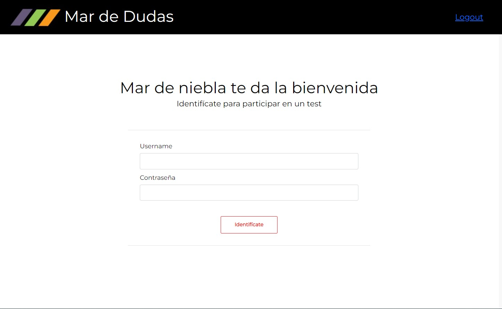
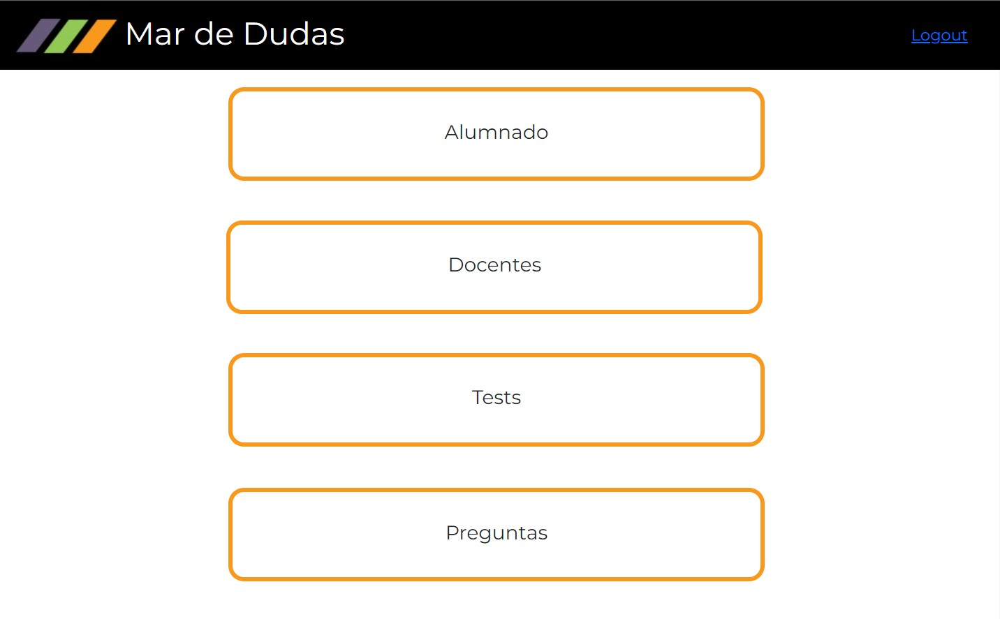
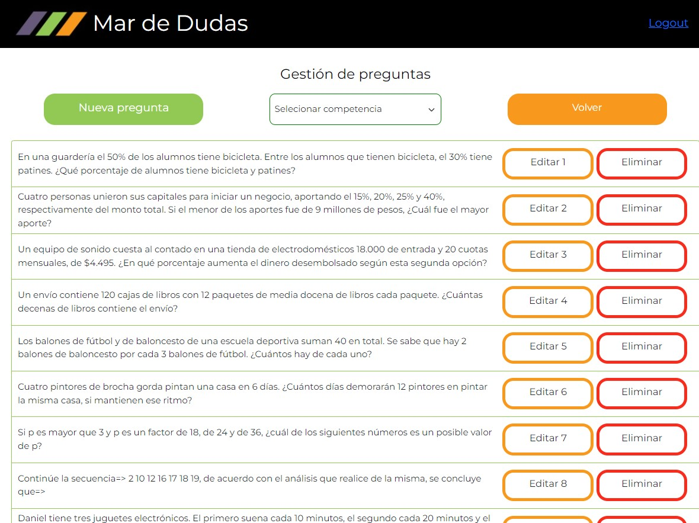
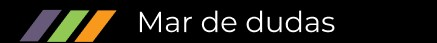
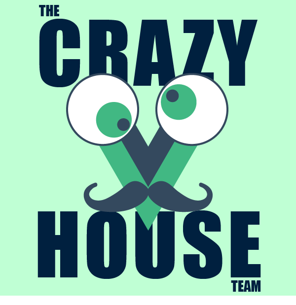

<h1 align="center" font="blond"> Mar de Dudas Project</h1>

# Description of the project 

The Mar de Dudas project has been carried out to meet the needs of the Mar de Niebla Social Action Foundation, which needed an application in which teachers could offer their students knowledge control questionnaires, but they wanted to do it in a way that students could interact on each question.
The teacher sends a question that the students receive on their pc to answer it, then the teacher corrects and explains the correct answer and the students will not be able to see the next question until the teacher sends the next question again.


<div style="display:flex; justify-content: space-around">
<div align="center">
<p style="margin: 10px"> Login Page</p>

</div>
<div align="center">
<p style="margin: 10px">Admin Page </p>

</div>
</div>

<div style="display:flex; justify-content: space-around"> 
<div align="center">
<p style="margin-top: 10px">Questions Page </p> 

</div>
<div align="center">
<p style="margin-top: 10px">New Question Page </p>
 
</div>
</div


# Functional requirements


<ul>
<li>There are two user options:
  <ol>Administrator: will be the teachers.</ol>
  <ol>Users: will be the students.</ol>
</li>
<li>As a teacher, you will generate an exam of 20 random questions taken from the database.</li>
<li>The teacher throws the first question and all the students in the class receive the question and the 4 answers on their screen, so they can select the answer.</li>
<li>The teacher will receive on his screen a statistic of who has answered which question and which was correct.</li>
<li>The teacher will move on to the next question when he decides.</li>
<li>At the end of the exam, the results of each student will be registered in the database, to be able to follow up.</li>
</ul>

# Technical requirements
<ul>
<li>How Admin could do the CRUD for the questions (the question, 4 possible answers, 1 correct)</li>
<li>As a teacher, you will register the students (CRUD), in the app.</li>
<li>As a teacher, you will generate an exam of 20 random questions taken from the database.</li>
<li>Good software development practices.</li>
</ul>

# Design Explanation
The app has several views with different options, a simple design has been chosen for a basic application, using the Mar de Niebla color palette and logo.





# Technical and used Tools

 <div align="center">
  
  
  
  
  
</div>
<div align="center">

  
  
   
</div>
<div align="center">
      
    
    
  
  
</div>


# How to run the project locally?
## Link, Cloning and Installation of our repository:
Clone the project :


```bash
Front End: 
https://github.com/Crazy-House-Team/MarNieblaFront
```
```bash
Back End: 
https://github.com/Crazy-House-Team/MarNieblaBack
```


## Other project links:
<ul>

Figma:
https://www.figma.com/file/afgFT1XE7uLomjNMwEis0k/Mar-de-Niebla?node-id=1%3A4

Jira: 
- Board: https://quintomilenio.atlassian.net/jira/software/projects/MDN/boards/5
- Roadmap: https://quintomilenio.atlassian.net/jira/software/projects/MDN/boards/5/roadmap

</ul>
***

# Front End Installation

## The instructions to proceed with the installation of the Front End will be found in the Readme found in the folder corresponding to the Front End.

***
# Back End Installation
Enter the project directory in the terminal and execute the following command:
```bash
php artisan migrate:fresh --seed
```
This will update our database.
**We will need to run this command every time we make changes to the project database.**


Install dependencies:
```bash
composer update
```
```bash
npm install
```
Import the following file into XAMPP: 
```bash
mardeniebla.sql
```
Start the server
```bash
npm run dev
```


<p align="center"><a href="https://laravel.com" target="_blank"></a></p>

<p align="center">
<a href="https://travis-ci.org/laravel/framework"></a>
<a href="https://packagist.org/packages/laravel/framework"></a>
<a href="https://packagist.org/packages/laravel/framework"></a>
<a href="https://packagist.org/packages/laravel/framework"></a>
</p>


***
## About Laravel

Laravel is a web application framework with expressive, elegant syntax. We believe development must be an enjoyable and creative experience to be truly fulfilling. Laravel takes the pain out of development by easing common tasks used in many web projects, such as:

- [Simple, fast routing engine](https://laravel.com/docs/routing).
- [Powerful dependency injection container](https://laravel.com/docs/container).
- Multiple back-ends for [session](https://laravel.com/docs/session) and [cache](https://laravel.com/docs/cache) storage.
- Expressive, intuitive [database ORM](https://laravel.com/docs/eloquent).
- Database agnostic [schema migrations](https://laravel.com/docs/migrations).
- [Robust background job processing](https://laravel.com/docs/queues).
- [Real-time event broadcasting](https://laravel.com/docs/broadcasting).

Laravel is accessible, powerful, and provides tools required for large, robust applications.

## Learning Laravel

Laravel has the most extensive and thorough [documentation](https://laravel.com/docs) and video tutorial library of all modern web application frameworks, making it a breeze to get started with the framework.

If you don't feel like reading, [Laracasts](https://laracasts.com) can help. Laracasts contains over 2000 video tutorials on a range of topics including Laravel, modern PHP, unit testing, and JavaScript. Boost your skills by digging into our comprehensive video library.

## Laravel Sponsors

We would like to extend our thanks to the following sponsors for funding Laravel development. If you are interested in becoming a sponsor, please visit the Laravel [Patreon page](https://patreon.com/taylorotwell).

### Premium Partners

- **[Vehikl](https://vehikl.com/)**
- **[Tighten Co.](https://tighten.co)**
- **[Kirschbaum Development Group](https://kirschbaumdevelopment.com)**
- **[64 Robots](https://64robots.com)**
- **[Cubet Techno Labs](https://cubettech.com)**
- **[Cyber-Duck](https://cyber-duck.co.uk)**
- **[Many](https://www.many.co.uk)**
- **[Webdock, Fast VPS Hosting](https://www.webdock.io/en)**
- **[DevSquad](https://devsquad.com)**
- **[Curotec](https://www.curotec.com/services/technologies/laravel/)**
- **[OP.GG](https://op.gg)**
- **[WebReinvent](https://webreinvent.com/?utm_source=laravel&utm_medium=github&utm_campaign=patreon-sponsors)**
- **[Lendio](https://lendio.com)**

## Contributing

Thank you for considering contributing to the Laravel framework! The contribution guide can be found in the [Laravel documentation](https://laravel.com/docs/contributions).

## Code of Conduct

In order to ensure that the Laravel community is welcoming to all, please review and abide by the [Code of Conduct](https://laravel.com/docs/contributions#code-of-conduct).

## Security Vulnerabilities

If you discover a security vulnerability within Laravel, please send an e-mail to Taylor Otwell via [taylor@laravel.com](mailto:taylor@laravel.com). All security vulnerabilities will be promptly addressed.

## License

The Laravel framework is open-sourced software licensed under the [MIT license](https://opensource.org/licenses/MIT).


## Project Created by The Crazy House Team during the Factoría F5 Bootcamp 2022

***
## The Crazy House Team Contact

- Fran: gimli22@gmail.com , https://github.com/Daevion32

- Susana: asturias.susi.pro@gmail.com , https://github.com/Susipro

- Sergio: sr.sergiofernandezfernandez@gmail.com , https://github.com/Sergio-Fernandez-Dev

- Bea: btrabanco@gmail.com , https://github.com/Trabanco
- Mario: marioastur@gmail.com , https://github.com/marioastur

- Dani: danimartinjuarez@gmail.com , https://github.com/danimartinjuarez


<div align="center">
<p> The Crazy House Team </p></div>

